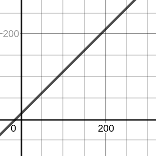

# Algorithmic Complexity Kickoff

Learning Objectives:

- Mention efficiency as one of the dimension of a good piece of code.
- Join a conversation about algorithms and their complexity.

## What is Algorithmic Complexity

What is an Algorithm?

- A sequence of steps that should be followed in order to solve a problem.

What is a solution?

- A particular output given a particular set if input values.

What is complexity?

- Time
- Memory/space/compute
- Overall efficiency
- Number of steps
- How it scales when the size of the input increases

## Omelette Algorithm

| Step                                | Time          |
| ----------------------------------- | ------------- |
| Break eggs one by one into the bowl | 1 min per egg |
| Mix eggs                            | 1 min         |
| Pour into hot pan                   | 0 min         |
| Wait until cooked                   | 10 min        |

| Input    | Calculation  | Total Time |
| -------- | ------------ | ---------- |
| 2 eggs   | 2 + 1 + 10   | 13 min     |
| 200 eggs | 200 + 1 + 10 | 211 min    |

$y = x + 11$

Where $y$ is the time to finish and $x$ is the number of eggs, which plots this graph, with time on the y axis and numebr of eggs on the x axis.

