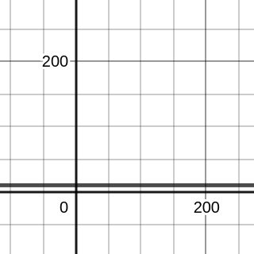
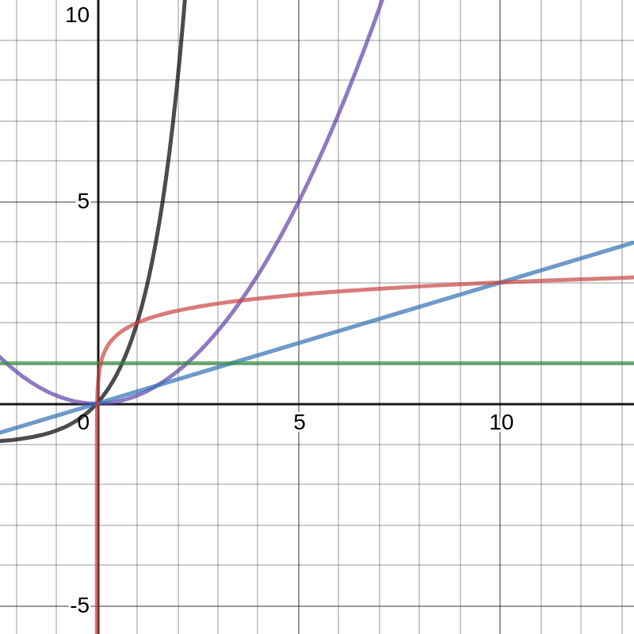

# Algorithmic Complexity Kickoff

Learning Objectives:

- Mention efficiency as one of the dimension of a good piece of code.
- Join a conversation about algorithms and their complexity.

## What is Algorithmic Complexity

What is an Algorithm?

- A sequence of steps that should be followed in order to solve a problem.

What is a solution?

- A particular output given a particular set if input values.

What is complexity?

- Time
- Memory/space/compute
- Overall efficiency
- Number of steps
- How it scales when the size of the input increases

## Omelette Algorithm

| Step                                | Time          |
| ----------------------------------- | ------------- |
| Break eggs one by one into the bowl | 1 min per egg |
| Mix eggs                            | 1 min         |
| Pour into hot pan                   | 0 min         |
| Wait until cooked                   | 10 min        |

| Input    | Calculation  | Total Time |
| -------- | ------------ | ---------- |
| 2 eggs   | 2 + 1 + 10   | 13 min     |
| 200 eggs | 200 + 1 + 10 | 211 min    |

$y = x + 11$

Where $y$ is the time to finish and $x$ is the number of eggs, which plots this graph, with time on the y axis and numebr of eggs on the x axis.

The time to mix and cook eggs though is always 11 minutes, $y = 11$.

## Types of Curve

A flat line is constant complexity in terms of big O notation is $O(1)$.

A curve that gets flatter as it goes on is logarithmic, in big O notation this is $O(log_2 n)$, (Logrithm base 2 of $n$).

If a line is straight but not flat, it is linear, which is $O(n)$.

If the line gets steeper, this is quadratic, which is $O(n^2)$. It could also be cubic which is $O(n^3)$.

Polynomial complexity is a general term for quadratic, cubic or higher.

The worst case is an exponential $O(3^n)$. This is the opposite of the logarithmic essentially.

## Practical

Write a timing framework and time the following inbuilt functions:

- last
- reverse
- shuffle
- sort

For arrays of lengths increasing up to 100,000.

Plot the results and see which time complexity they are.
